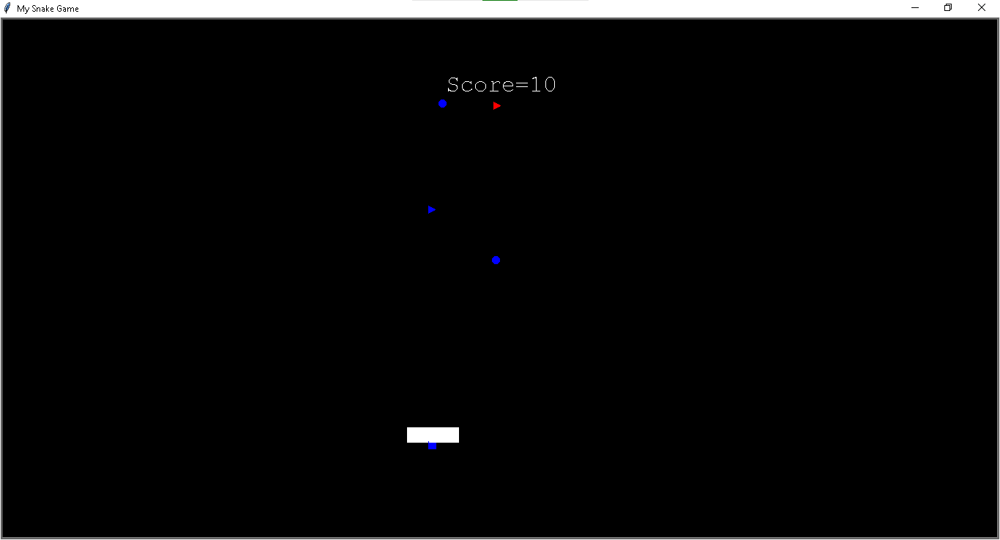

<h1>Simple Snake Game using Python and Turtle Package</h1>
    <h2>Keys used in game</h2>
    <ul>
        <Li>UP KEY</Li>
        <Li>DOWN KEY</Li>
        <Li>LEFT KEY</Li>
        <Li>RIGHT KEY</Li>
    </ul>
<h2>Food score</h2>
 <ul>
 <li>Square:4</li>
 <li>Triange:3</li>
 <li>Circle:1</li>
 </ul>
    <h2>Output</h2>
    
